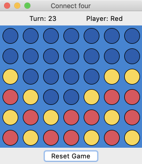
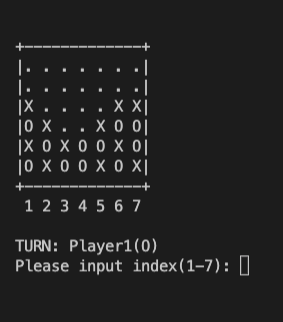
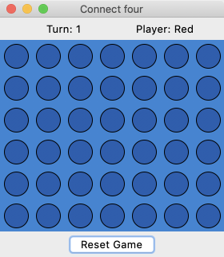
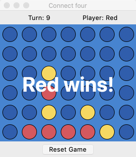
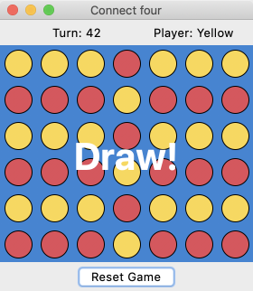
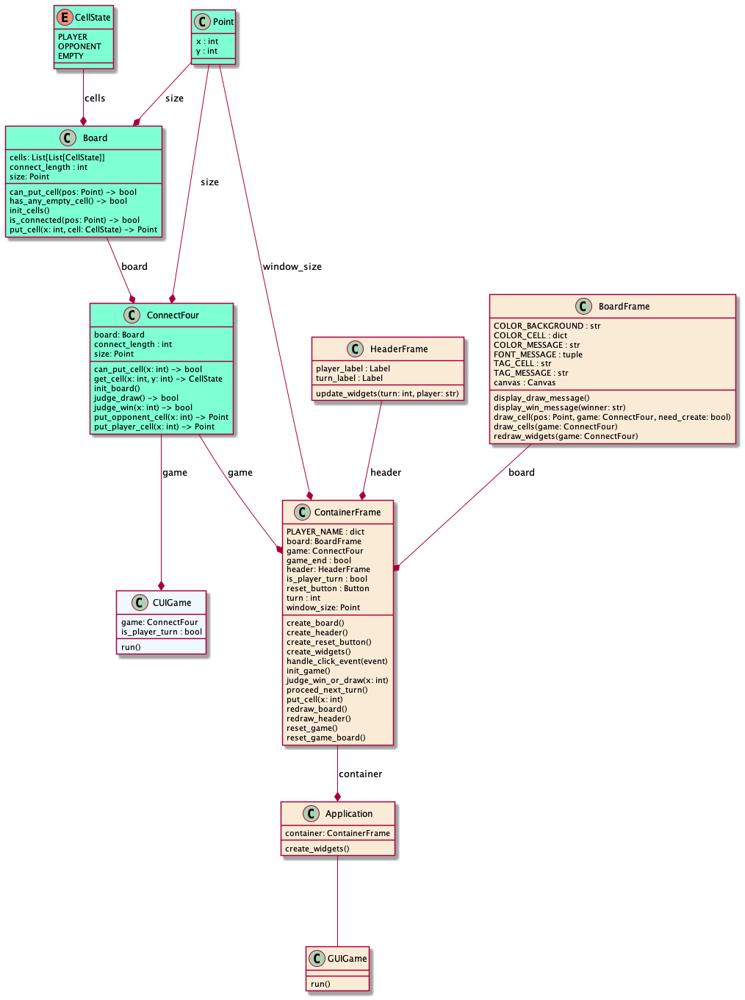
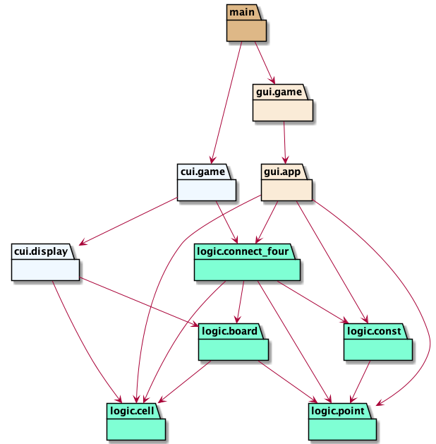

# dena-review


目次

- [概要](#概要)
- [必要物](#必要物)
- [使い方](#使い方)
  - [リポジトリのclone](#リポジトリのclone)
  - [GUIゲームのプレイ](#guiゲームのプレイ)
  - [CUIゲームのプレイ](#cuiゲームのプレイ)
- [開発者向け情報](#開発者向け情報)
  - [必要物](#必要物-1)
  - [ディレクトリ構成](#ディレクトリ構成)
  - [開発用各種コマンド](#開発用各種コマンド)
    - [Test](#test)
    - [Lint](#lint)
    - [Format](#format)
  - [CI](#ci)
  - [UML図](#uml図)
    - [クラス図](#クラス図)
    - [パッケージ図](#パッケージ図)
- [ライセンス](#ライセンス)

## 概要

Python製の四目並べ（Connect four）ゲームです。

GUI（デスクトップアプリ）, CUI（Terminal）でプレイできます。

 

## 必要物

- Python 3.8 以上

## 使い方

### リポジトリのclone

```bash
git clone https://github.com/nafuka11/dena-review.git
```

### GUIゲームのプレイ

```bash
make gui
```



画面の青い部分のボードをクリックして、コマを配置します。

「Reset Game」ボタンでゲームをリセットできます。

いずれかのプレイヤーが勝った場合、または引き分けた場合、以下のような表示となります。

 

### CUIゲームのプレイ

```bash
make cui
```

初期状態は以下のような表示となります。

```
+-------------+
|. . . . . . .|
|. . . . . . .|
|. . . . . . .|
|. . . . . . .|
|. . . . . . .|
|. . . . . . .|
+-------------+
 1 2 3 4 5 6 7

TURN: Player1(O)
Please input index(1-7): 
```

1から7までの行番号を入力し、コマを配置します。  
プレイヤーのどちらかが勝つか引き分けるかした場合、ゲームを終了します。

## 開発者向け情報

### 必要物

以下のツールがインストールされている必要があります。

- Poetry

### ディレクトリ構成

|ディレクトリ名|説明|
|--|--|
|docs|READMEの画像ファイル, UML図作成に使うpumlファイル|
|cui|CUIゲームのソースファイル|
|gui|GUIゲームのソースファイル|
|logic|四目並べのロジック部分のソースファイル|

### 開発用各種コマンド

開発に使う各種コマンドは以下で確認できます。

```bash
make help
```

#### Test

```
make test
```

pytestを使って `logic/` のテストを行います。

- `cui/`, `gui/` のテストは行っていません。現状、手動で確認しています

#### Lint

```
make lint
```

flake8, black, mypy, isortを使ってチェックをします。

それぞれのパッケージは以下の内容をチェックしています。

- flake8：PythonのコーディングスタイルPEP8に沿っているか、ソースコードのエラーがないか。
- black：コードがフォーマットされているか。
- mypy：静的型チェッカー。
- isort：モジュールのimport順がソートされているか。

#### Format

```
make format
```

black, isortを使ってコードをフォーマットします。

- black：PEP8に沿ったコードのフォーマット。
- isort：import順序のフォーマット。

### CI

GitHub Actionsを使い、以下のイベントが発生した場合、testとlintが走るようになっています。

- mainブランチへのpush
- mainブランチへのPullRequest

### UML図

#### クラス図



#### パッケージ図



## ライセンス

[MIT License](LICENSE) です。
