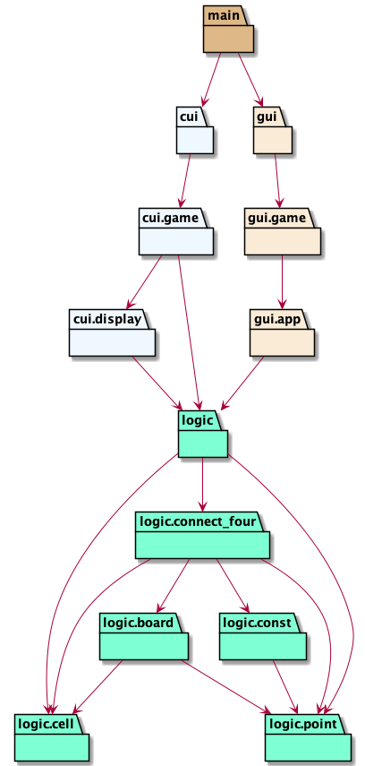

# dena-review


## 概要

Python製の四目並べ（Connect four）ゲームです。

GUI（デスクトップアプリ）, CUI（Terminal）でプレイできます。

 

## 必要物

- Python 3.8 以上

## 使い方

### リポジトリのclone

```bash
git clone https://github.com/nafuka11/dena-review.git
```

### GUIゲームのプレイ

```bash
make gui
```


クリックした行にコマを配置します。

「Reset Game」ボタンでゲームをリセットできます。

いずれかのプレイヤーが買った場合、引き分けの場合、以下のような表示となります。

 

### CUIゲームのプレイ

```bash
make cui
```

初期状態は以下のような表示となります。

```
+-------------+
|. . . . . . .|
|. . . . . . .|
|. . . . . . .|
|. . . . . . .|
|. . . . . . .|
|. . . . . . .|
+-------------+
 1 2 3 4 5 6 7

TURN: Player1(O)
Please input index(1-7): 
```

1から7までの行番号を入力し、コマを配置します。
プレイヤーのどちらかが勝つか引き分けるかした場合、ゲームを終了します。

## 開発者向け情報

### 必要物

以下のツールがインストールされている必要があります。

- Poetry

### 各種コマンド

開発に使う各種コマンドは以下で確認できます。

```bash
make help
```

#### Test

```
make test
```

pytestを使って `logic/` のテストを行います。

- `cui/`, `gui/` のテストは行っていません。現状、手動で確認しています

#### Lint

```
make lint
```

flake8, black, mypy, isortを使ってチェックをします。

それぞれのパッケージは以下の内容をチェックしています。

- flake8：PythonのコーディングスタイルPEP8に沿っているか、ソースコードのエラーがないか。
- black：コードがフォーマットされているか。
- mypy：静的型チェッカー。
- isort：モジュールのimport順がソートされているか。

#### Format

```
make format
```

black, isortを使ってコードをフォーマットします。

- black：PEP8に沿ったコードのフォーマット。
- isort：import順序のフォーマット。

### CI

GitHub Actionsを使い、以下のイベントが発生した場合、testとlintが走るようになっています。

- mainブランチへのpush
- mainブランチへのPullRequest

### UML図

#### クラス図


#### パッケージ図


